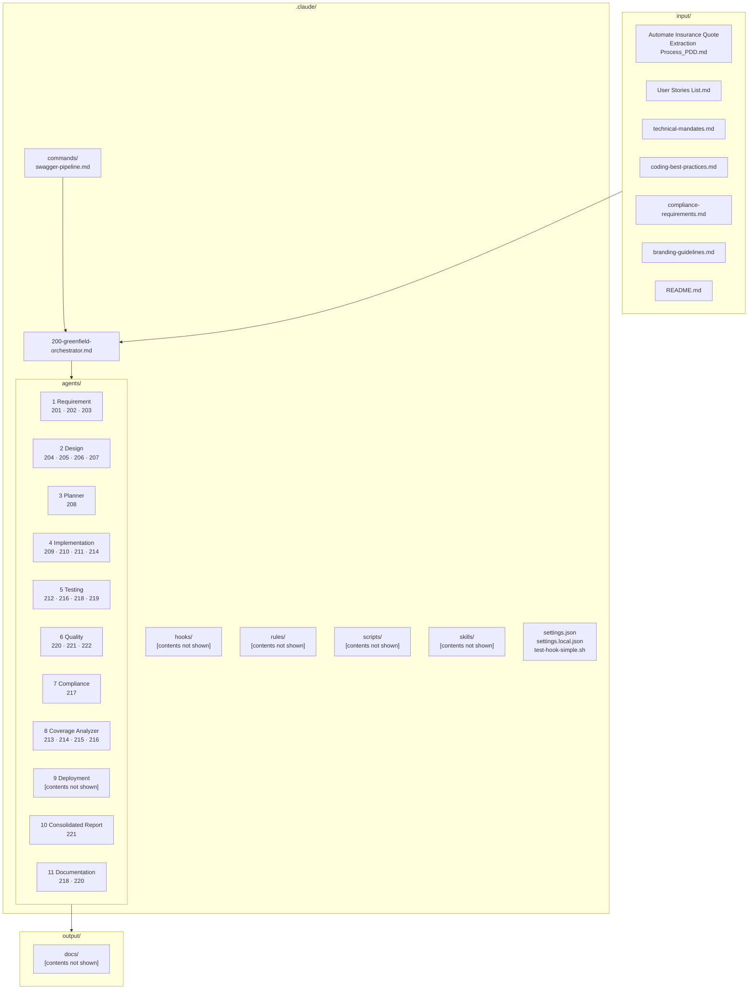
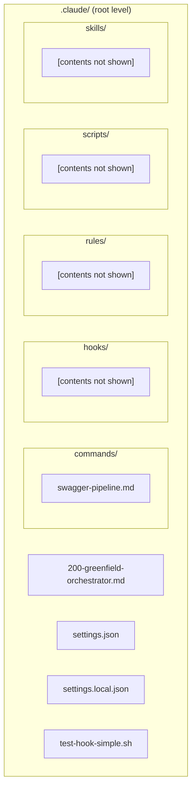
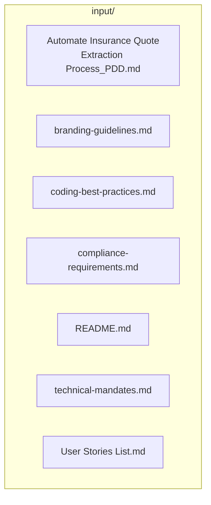

# RPG Forward Engineering Framework — Diagrams

> **Source:** Based strictly on screenshots provided. Folders whose contents were not shown are marked `[contents not shown]`. Nothing has been assumed or inferred.

---

## 1. Exact Directory Structure (from screenshots)

```
RPG FORWARD ENGINEERING (project root)
│
├── .claude/
│   ├── agents/
│   │   ├── 1 Requirement/
│   │   │   ├── 201-pdd-parser.md
│   │   │   ├── 202-user-stories-processor.md
│   │   │   └── 203-requirements-consolidator.md
│   │   │
│   │   ├── 2 Design/
│   │   │   ├── 204-tech-stack-configurator.md
│   │   │   ├── 205-architecture-designer.md
│   │   │   ├── 206-database-designer.md
│   │   │   └── 207-api-contract-designer.md
│   │   │
│   │   ├── 3 Planner/
│   │   │   └── 208-task-planner.md
│   │   │
│   │   ├── 4 Implementation/
│   │   │   ├── 209-backend-implementation.md
│   │   │   ├── 210-frontend-implementation.md
│   │   │   ├── 211-database-implementation.md
│   │   │   └── 214-component-library-builder.md
│   │   │
│   │   ├── 5 Testing/
│   │   │   ├── 212-test-suite-generator.md
│   │   │   ├── 216-frontend-test-generator.md
│   │   │   ├── 218-accessibility-validator.md
│   │   │   └── 219-test-data-generator.md
│   │   │
│   │   ├── 6 Quality/
│   │   │   ├── 220-code-best-practices-enforcer.md
│   │   │   ├── 221-design-compliance-validator.md
│   │   │   └── 222-branding-compliance-checker.md
│   │   │
│   │   ├── 7 Compliance/
│   │   │   └── 217-compliance-checker.md
│   │   │
│   │   ├── 8 Coverage Analyzer/
│   │   │   ├── 213-code-coverage-analyzer.md
│   │   │   ├── 214-security-scanner.md
│   │   │   ├── 215-memory-leak-detector.md
│   │   │   └── 216-performance-analyzer.md
│   │   │
│   │   ├── 9 Deployment/
│   │   │   └── [contents not shown]
│   │   │
│   │   ├── 10 Consolidated Report/
│   │   │   └── 221-report-consolidator.md
│   │   │
│   │   ├── 11 Documentation/
│   │   │   ├── 218-deployment-config-generator.md
│   │   │   └── 220-documentation-generator.md
│   │   │
│   │   └── 200-greenfield-orchestrator.md
│   │
│   ├── commands/
│   │   └── swagger-pipeline.md
│   │
│   ├── hooks/                        [contents not shown]
│   ├── rules/                        [contents not shown]
│   ├── scripts/                      [contents not shown]
│   ├── skills/                       [contents not shown]
│   ├── settings.json
│   ├── settings.local.json
│   └── test-hook-simple.sh
│
├── card demo/                        [contents not shown]
├── docs/                             [contents not shown]
│
├── input/
│   ├── Automate Insurance Quote Extraction Process_PDD.md   (name truncated in screenshot)
│   ├── branding-guidelines.md
│   ├── coding-best-practices.md
│   ├── compliance-requirements.md
│   ├── README.md
│   ├── technical-mandates.md
│   └── User Stories List.md
│
└── output/
    └── docs/                         [contents not shown]
```

---

## 2. High-Level Architecture



---

## 3. Agent Pipeline — Phase Sequence

```mermaid
flowchart TD
    INPUT(["input/\nPDD · User Stories · Mandates\nBest Practices · Compliance · Branding"])

    INPUT --> ORCH["200-greenfield-orchestrator.md"]

    ORCH --> A1

    subgraph PHASE1 ["1 · Requirement"]
        R1["201-pdd-parser.md"]
        R2["202-user-stories-processor.md"]
        R3["203-requirements-consolidator.md"]
    end

    A1[ ] -.-> PHASE1

    PHASE1 --> A2

    subgraph PHASE2 ["2 · Design"]
        D1["204-tech-stack-configurator.md"]
        D2["205-architecture-designer.md"]
        D3["206-database-designer.md"]
        D4["207-api-contract-designer.md"]
    end

    A2[ ] -.-> PHASE2

    PHASE2 --> A3

    subgraph PHASE3 ["3 · Planner"]
        P1["208-task-planner.md"]
    end

    A3[ ] -.-> PHASE3

    PHASE3 --> A4

    subgraph PHASE4 ["4 · Implementation"]
        IM1["209-backend-implementation.md"]
        IM2["210-frontend-implementation.md"]
        IM3["211-database-implementation.md"]
        IM4["214-component-library-builder.md"]
    end

    A4[ ] -.-> PHASE4

    PHASE4 --> A5

    subgraph PHASE5 ["5 · Testing"]
        T1["212-test-suite-generator.md"]
        T2["216-frontend-test-generator.md"]
        T3["218-accessibility-validator.md"]
        T4["219-test-data-generator.md"]
    end

    A5[ ] -.-> PHASE5

    PHASE5 --> A6

    subgraph PHASE6 ["6 · Quality"]
        Q1["220-code-best-practices-enforcer.md"]
        Q2["221-design-compliance-validator.md"]
        Q3["222-branding-compliance-checker.md"]
    end

    A6[ ] -.-> PHASE6

    PHASE6 --> A7

    subgraph PHASE7 ["7 · Compliance"]
        CO1["217-compliance-checker.md"]
    end

    A7[ ] -.-> PHASE7

    PHASE7 --> A8

    subgraph PHASE8 ["8 · Coverage Analyzer"]
        CA1["213-code-coverage-analyzer.md"]
        CA2["214-security-scanner.md"]
        CA3["215-memory-leak-detector.md"]
        CA4["216-performance-analyzer.md"]
    end

    A8[ ] -.-> PHASE8

    PHASE8 --> A9

    subgraph PHASE9 ["9 · Deployment"]
        DEP["[contents not shown]"]
    end

    A9[ ] -.-> PHASE9

    PHASE9 --> A10

    subgraph PHASE10 ["10 · Consolidated Report"]
        CR1["221-report-consolidator.md"]
    end

    A10[ ] -.-> PHASE10

    PHASE10 --> A11

    subgraph PHASE11 ["11 · Documentation"]
        DOC1["218-deployment-config-generator.md"]
        DOC2["220-documentation-generator.md"]
    end

    A11[ ] -.-> PHASE11

    PHASE11 --> OUT(["output/docs/"])
```



---

## 4. Sub-Agents per Phase

```mermaid
graph LR
    subgraph P1 ["1 · Requirement"]
        direction TB
        r1["201-pdd-parser.md"]
        r2["202-user-stories-processor.md"]
        r3["203-requirements-consolidator.md"]
    end

    subgraph P2 ["2 · Design"]
        direction TB
        d1["204-tech-stack-configurator.md"]
        d2["205-architecture-designer.md"]
        d3["206-database-designer.md"]
        d4["207-api-contract-designer.md"]
    end

    subgraph P3 ["3 · Planner"]
        direction TB
        p1["208-task-planner.md"]
    end

    subgraph P4 ["4 · Implementation"]
        direction TB
        i1["209-backend-implementation.md"]
        i2["210-frontend-implementation.md"]
        i3["211-database-implementation.md"]
        i4["214-component-library-builder.md"]
    end

    subgraph P5 ["5 · Testing"]
        direction TB
        t1["212-test-suite-generator.md"]
        t2["216-frontend-test-generator.md"]
        t3["218-accessibility-validator.md"]
        t4["219-test-data-generator.md"]
    end

    subgraph P6 ["6 · Quality"]
        direction TB
        q1["220-code-best-practices-enforcer.md"]
        q2["221-design-compliance-validator.md"]
        q3["222-branding-compliance-checker.md"]
    end

    subgraph P7 ["7 · Compliance"]
        direction TB
        c1["217-compliance-checker.md"]
    end

    subgraph P8 ["8 · Coverage Analyzer"]
        direction TB
        a1["213-code-coverage-analyzer.md"]
        a2["214-security-scanner.md"]
        a3["215-memory-leak-detector.md"]
        a4["216-performance-analyzer.md"]
    end

    subgraph P9 ["9 · Deployment"]
        direction TB
        dep["[contents not shown]"]
    end

    subgraph P10 ["10 · Consolidated Report"]
        direction TB
        rp1["221-report-consolidator.md"]
    end

    subgraph P11 ["11 · Documentation"]
        direction TB
        doc1["218-deployment-config-generator.md"]
        doc2["220-documentation-generator.md"]
    end

    P1 --> P2 --> P3 --> P4 --> P5 --> P6 --> P7 --> P8 --> P9 --> P10 --> P11
```



---

## 5. .claude/ Root Files



---

## 6. input/ Files



---

## 7. Complete Agent File Index

| Phase | File |
|-------|------|
| **1 · Requirement** | `201-pdd-parser.md` |
| | `202-user-stories-processor.md` |
| | `203-requirements-consolidator.md` |
| **2 · Design** | `204-tech-stack-configurator.md` |
| | `205-architecture-designer.md` |
| | `206-database-designer.md` |
| | `207-api-contract-designer.md` |
| **3 · Planner** | `208-task-planner.md` |
| **4 · Implementation** | `209-backend-implementation.md` |
| | `210-frontend-implementation.md` |
| | `211-database-implementation.md` |
| | `214-component-library-builder.md` |
| **5 · Testing** | `212-test-suite-generator.md` |
| | `216-frontend-test-generator.md` |
| | `218-accessibility-validator.md` |
| | `219-test-data-generator.md` |
| **6 · Quality** | `220-code-best-practices-enforcer.md` |
| | `221-design-compliance-validator.md` |
| | `222-branding-compliance-checker.md` |
| **7 · Compliance** | `217-compliance-checker.md` |
| **8 · Coverage Analyzer** | `213-code-coverage-analyzer.md` |
| | `214-security-scanner.md` |
| | `215-memory-leak-detector.md` |
| | `216-performance-analyzer.md` |
| **9 · Deployment** | `[contents not shown]` |
| **10 · Consolidated Report** | `221-report-consolidator.md` |
| **11 · Documentation** | `218-deployment-config-generator.md` |
| | `220-documentation-generator.md` |
| **Orchestrator** | `200-greenfield-orchestrator.md` |
| **Commands** | `swagger-pipeline.md` |
| **Support** | `settings.json` · `settings.local.json` · `test-hook-simple.sh` |
| **input/** | `Automate Insurance Quote Extraction Process_PDD.md` · `branding-guidelines.md` · `coding-best-practices.md` · `compliance-requirements.md` · `README.md` · `technical-mandates.md` · `User Stories List.md` |
| **Folders (no files shown)** | `hooks/` · `rules/` · `scripts/` · `skills/` · `card demo/` · `docs/` · `output/docs/` |

